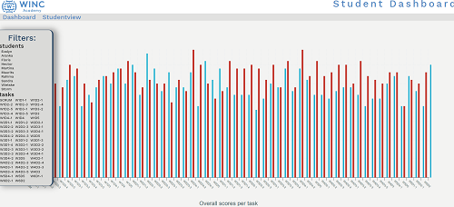

# Winc Student Dashboard

## Requirements

Jouw WebApplicatie **moet het volgende weergeven**

1. Als je de pagina (tool) opent zien we gelijk een staafdiagram met de evaluaties voor alle dagen van alle studenten – Laat een staafdiagram zien van de evaluaties (meting van beide cijfers tegelijk)
2. Per student aparte Routing - op deze dedicated pagina's voor 1 student krijg je een grafiek te zien van de data van 1 student. 
3. Als gebruiker van de tool kan je op een aantal manieren de data "slicen en dicen". 
**Kies één van de onderstaande manieren:**
    - Één of beide metingen weergeven (dus óf hoe leuk de opdracht was, óf hoe moeilijk, óf beide!)
    - Weergave van de metingen van meerdere mensen, filteren op naam van de studenten die je wilt laten weergeven (van een of n-aantal studenten). 
 
    - Gemiddelde cijfer in de vorm van line chart....
        - van een student voor alle opdrachten
        - van een opdracht over alle studenten

4. Design: Maak een tool waar je trots op bent en wat je aan een toekomstige werkgever zou willen laten zien.
